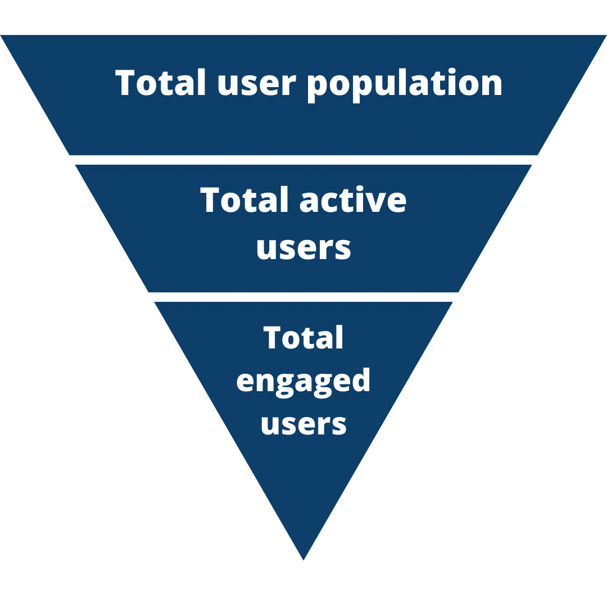

# [User Engagement : What It is & Why you Might Be Measuring It Wrong](https://www.parlor.io/blog/user-engagement-what-it-is-why-you-might-be-measuring-it-wrong/)

## 1. Definitions of User Engagement

- a catch-all term encompassing any interaction your users have within your product or your app
- It can be as simple as a log in, or engagement can be tied to a specific activity or set of activities within your product
- **There isn’t a truly universal product engagement metric.** Because the nature of user engagement can vary so widely from product to product
- the primary goal is to measure the leading indicators of whether your users find your product valuable enough to continue using it.

## 2. The Importance of User Engagement

- It’s important to put yourself in the shoes of a user when considering their engagement
- Not only is user engagement correlated with how users value your product, it’s also highly associated with your churn rate
- Think of better customer engagement as anti-churn
- An engaged user base does more than slow the rate of unsubscribes. It also increases up-sells and drives referrals of new customers.

## 3. Common metric used for user engagement

- The most widely used way to measure user engagement or customer engagement is through some form of temporal engagement metric (i.e. daily, monthly, or quarterly active users).
- The actual time window which is appropriate for a product depends on that product’s reasonable engagement frequency
- For example, in a product like TurboTax, daily active users likely doesn’t make sense given that tax season happens only once a year.
- On the other hand, a social media app like Instagram may focus primarily on daily active users as the temporal metric that makes the most sense.
- **It’s important for a team to create their own unique definition of what is considered an active user when setting a baseline user engagement metric.**
- The majority of companies tend to set a fairly low bar when defining what an ‘active’ user is. For many, active simply means “has logged into our product” within a specific timeframe.
- **For example**, imagine an app that provides flashcards to help students prepare for tests. Based on how this app is used, it might not make sense to define an active user as any user that logs into the app each week. Instead, a more product-specific definition of an active user for this flashcard app could be any user that has completed 10 flashcards this week. This is still a fairly low bar, but is much more intellectually honest than our default alternative of “has logged in”.
- Whatever definition of active makes sense for your product, we recommend going beyond a simple count of “active” by establishing what we call an Engagement Funnel.

## 4. Building an Engagement Funnel

- The idea behind an engagement funnel is to divide your user population into different tiers based on their level of engagement with your product. Within your total user population, you’ll have an inactive tier and an active tier (using your definition of active).

- Using user segments, the engagement funnel allows you to:

  - Visualize the breakdown of your entire user population across different levels of engagement
  - Determine the percentage of your total user population that is actively using your product
  - Determine the percentage of that active user population that is even more deeply engaged in your product
  - Quickly identify where in your engagement funnel your team should focus its efforts (e.g. adding more total users, or making more of your active users deeply engaged)

  

## 5. How Product Teams Can Use The Engagement Funnel

- Many companies focus primarily on increasing their total number of users (denominator/top part of our funnel).
- While this is a good company-wide metric for growth as it is impacted by multiple teams such as marketing, sales, and customer support, it is not an actionable product team metric.
- **Increasing total users doesn’t tell us whether we’ve improved the product experience and associated value that users get from the product. It just puts more users into our current engagement funnel.**
- By focusing instead on increasing the percentages of active and engaged users, product teams can more directly impact the value that users receive from the product, and thus the long-term health of their user population.
